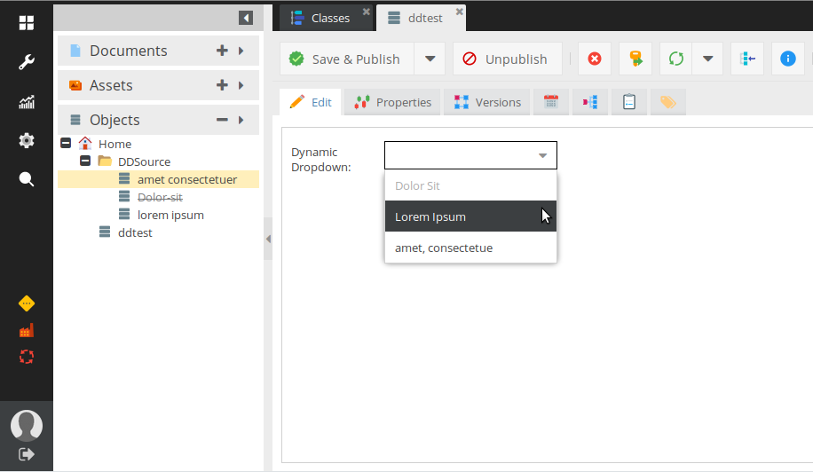

# Pimcore - Dynamic Dropdown

[](https://packagist.org/packages/thomas-keil/dynamic-dropdown)  [](https://packagist.org/packages/thomas-keil/dynamic-dropdown)

Dynamic Dropdown allows you to populate pimcore input fields with the content of other objcts.



## Getting started

* Download Plugin and place it in your plugins directory
* Open Extension Manager in Pimcore and enable/install Plugin
* After Installation within Pimcore Extension Manager, you have to reload Pimcore

or install it via composer on an existing pimcore installation

```
composer require thomas-keil/dynamic-dropdown
```

## Configuring

The plugin provides several input elements and thus extends pimcores
class data compent menu in the section "Select".

### Dynamic Dropdown


The Dynamic Dropdown is the "classic" version of the provided input elements:
a dropdown input field (ExtJS: Combobox). Every option is provided by an object
in a configured folder, by a configured method.
The folder can have nested subfolders, but only one type of object class can provide
the data.


#### Options


Following options need to be set:

* Width: the width of input element
* Parent ID: the path to the folder containing the source objects. You can use drag&drop
* Recursive: check this if objects in subfolders shall be used as well
* Unpublished selectable: usually unpublished objects will be displayed in the item list, but be of a grey color and unselectable. Check this if you want unpublished objects to be selectable.
* Sort by: either "Value" or "Id". By value is alphabetically ascending, by Id is numerically ascending by pimcore's object id.
* Allowed classes: the object class, that provides the data. Only objects of this class we be considered, all others will be ignored.
* Method: the method that provides the data. The possible methods are extracted from the class definition of the source class.

